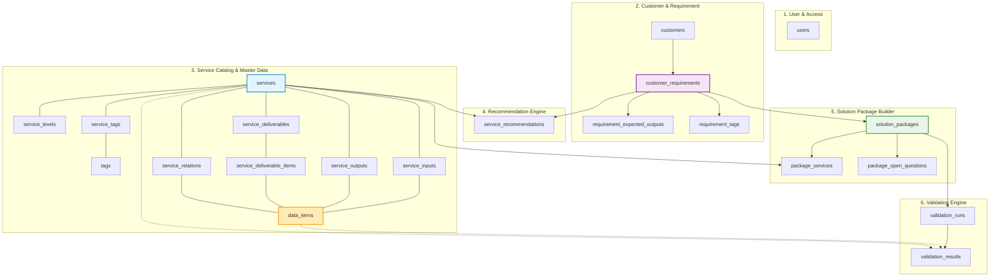

# HỆ THỐNG CƠ SỞ DỮ LIỆU GASCOLAE PACKAGE BUILDER
## GIẢI THÍCH CHI TIẾT Ý NGHĨA VÀ VAI TRÒ CÁC BẢNG (DATABASE TABLES EXPLANATION)

---

## 1. TỔNG QUAN KIẾN TRÚC DỮ LIỆU

Hệ thống cơ sở dữ liệu **GASCOLAE Package Builder** được thiết kế gồm **21 bảng** trên nền tảng **PostgreSQL** (sử dụng UUID v4 làm khóa chính), chia thành **6 phân hệ nghiệp vụ** gắn kết chặt chẽ theo luồng vận hành từ tiếp nhận yêu cầu đến xuất gói giải pháp kỹ thuật:

---

## 2. CHI TIẾT CÁC PHÂN HỆ VÀ Ý NGHĨA TỪNG BẢNG

---

### PHÂN HỆ 1: TÀI KHOẢN & PHÂN QUYỀN (USER / ACCESS)

Phân hệ quản lý định danh người dùng nội bộ tham gia vào quy trình tư vấn và thiết kế giải pháp.

#### 1. `users` (Tài khoản người dùng hệ thống)
* **Ý nghĩa:** Quản lý nhân sự của GASCOLAE đăng nhập vào hệ thống.
* **Vai trò:**
  * Lưu trữ thông tin nhân viên: `email`, `full_name`, `role`.
  * Hỗ trợ 3 nhóm vai trò chính:
    * `SALES_PRE_SALES`: Nhân viên kinh doanh tiếp nhận nhu cầu từ khách hàng, tạo dự thảo gói giải pháp.
    * `OPERATION`: Kỹ sư kỹ thuật/vận hành kiểm định tính khả thi, trả lời câu hỏi chuyên môn.
    * `ADMIN`: Quản trị viên hệ thống, quản lý danh mục dịch vụ Master Data.
  * Phục vụ ghi nhận vết kiểm toán: ai tạo requirement (`created_by`), ai xác nhận (`confirmed_by`), ai tạo gói giải pháp.

---

### PHÂN HỆ 2: KHÁCH HÀNG & NHU CẦU DỰ ÁN (CUSTOMER / REQUIREMENT)

Phân hệ tiếp nhận, số hóa và chuẩn hóa các bài toán nghiệp vụ từ phía đối tác/khách hàng.

#### 2. `customers` (Hồ sơ khách hàng)
* **Ý nghĩa:** Quản lý thông tin tổ chức, doanh nghiệp hoặc cá nhân liên hệ sử dụng dịch vụ.
* **Vai trò:**
  * Lưu thông tin định danh: `customer_code` (duy nhất), `customer_name`, `company_name`, `industry` (ngành nghề), `contact_email`, `contact_phone`.
  * Trạng thái hoạt động: `ACTIVE`, `INACTIVE`.
  * Một khách hàng có thể phát sinh nhiều dự án/nhu cầu khác nhau theo thời gian.

#### 3. `customer_requirements` (Đề bài / Yêu cầu dự án của khách hàng)
* **Ý nghĩa:** Trái tim của giai đoạn tiếp nhận, lưu trữ toàn bộ thông số đề bài của dự án.
* **Vai trò:**
  * Lưu trữ văn bản yêu cầu gốc từ khách hàng: `raw_requirement_text`.
  * Các thông số quy mô kỹ thuật: `area_value` (diện tích), `area_unit` (ha, m², km²), `environment_raw` (rừng, bãi rác, đất nông nghiệp, đô thị...).
  * Cách thức bóc tách thông tin: `extraction_method` (`AI` bóc tách tự động hoặc `MANUAL` do Sales nhập tay) kèm độ tin cậy `extraction_confidence`.
  * Vòng đời xét duyệt: `DRAFT` (nháp) $\rightarrow$ `CONFIRMED` (đã được Sales/Admin chốt) $\rightarrow$ `ARCHIVED`. Chỉ các requirement ở trạng thái `CONFIRMED` mới được đưa vào chạy Recommendation Engine.

#### 4. `requirement_expected_outputs` (Đầu ra kỳ vọng của dự án)
* **Ý nghĩa:** Danh sách các sản phẩm/kết quả mà khách hàng cụ thể muốn nhận được từ dự án này.
* **Vai trò:**
  * Cho phép khách hàng mô tả tự do (`raw_expected_output`) hoặc chọn trực tiếp từ từ điển dữ liệu chuẩn (`data_item_id`).
  * Gán mức độ ưu tiên: `LOW`, `NORMAL`, `HIGH`, `REQUIRED`.
  * Đây là **cơ sở số 1** để thuật toán Recommendation Engine quét tìm dịch vụ nào có `service_outputs` trùng khớp với mong muốn của khách.

#### 5. `requirement_tags` (Nhãn phân loại của đề bài)
* **Ý nghĩa:** Bảng liên kết trung gian gắn các nhãn chuẩn hóa (`tags`) vào yêu cầu dự án.
* **Vai trò:**
  * Ánh xạ đề bài vào các chiều phân loại: Mục tiêu dự án (`OBJECTIVE`), Lĩnh vực (`INDUSTRY`), Điều kiện môi trường (`ENVIRONMENT`).
  * Giúp thuật toán so khớp đặc tính dự án với đặc tính của 12 dịch vụ kỹ thuật số.

---

### PHÂN HỆ 3: DANH MỤC DỊCH VỤ MASTER DATA (SERVICE CATALOG & TAXONOMY)

Bộ "từ điển dữ liệu mẹ" chuẩn hóa toàn bộ năng lực cung cấp dịch vụ của GASCOLAE (12 dịch vụ cốt lõi: bay chụp UAV, viễn thám vệ tinh, AI đo đạc sinh khối, kiểm kê khí nhà kính, quan trắc cháy rừng...).

#### 6. `services` (Danh mục dịch vụ kỹ thuật số)
* **Ý nghĩa:** Lưu trữ thông tin tổng quan của 12 dịch vụ cốt lõi GASCOLAE.
* **Vai trò:**
  * Quản lý thông tin định danh: `service_code` (ví dụ `S0269`, `S0270`...), `service_name`, tên tiếng Anh `service_name_en`, `category`.
  * Mô tả nghiệp vụ chuyên sâu: `target_customer` (khách hàng mục tiêu), `customer_problems` (nỗi đau khách hàng giải quyết được), `use_cases` (trường hợp ứng dụng), `technologies` (công nghệ sử dụng: LiDAR, Multispectral, AI...).
  * Trạng thái xác minh: `lifecycle_status` (`DRAFT`, `APPROVED`), `verification_status` (`VERIFIED`, `NEED_VERIFY`).

#### 7. `service_levels` (Cấp độ dịch vụ - Service Levels)
* **Ý nghĩa:** Phân cấp độ chuyên sâu kỹ thuật cho từng dịch vụ (36 cấp độ, 3 level/dịch vụ).
* **Vai trò:**
  * Mỗi dịch vụ thường chia làm 3 cấp độ: `level_no` = 1 (Cơ bản/Khảo sát), 2 (Tiêu chuẩn/Phân tích bán tự động), 3 (Nâng cao/AI thời gian thực).
  * Định lượng độ phân giải không gian, độ chính xác tọa độ, chu kỳ lặp lại cho từng cấp độ, giúp khách hàng chọn gói vừa vặn với ngân sách.

#### 8. `tags` (Từ điển nhãn phân loại đa chiều)
* **Ý nghĩa:** Danh mục từ điển nhãn phân loại thống nhất trong toàn hệ sinh thái.
* **Vai trò:**
  * Phân loại theo 5 nhóm:
    * `OBJECTIVE`: Mục tiêu (ví dụ: `CARBON_CREDIT_MRV`, `DROUGHT_WATER_STRESS`, `FIRE_RISK_PREVENTION`...).
    * `INDUSTRY`: Ngành kinh tế (ví dụ: `FORESTRY`, `AGRICULTURE`, `WASTE_MANAGEMENT`...).
    * `ENVIRONMENT`: Địa hình/Môi trường (ví dụ: `FOREST`, `CROPLAND`, `URBAN_AREA`...).
    * `TOPIC`: Chủ đề kỹ thuật (ví dụ: `multispectral`, `albedo`, `LiDAR`...).
    * `KEYWORD`: Từ khóa tìm kiếm nhanh.
  * Hỗ trợ quan hệ phân cấp hình cây thông qua `parent_tag_id` (ví dụ: Tag "Bảo tồn" thuộc cha "Lâm nghiệp").

#### 9. `service_tags` (Bảng gán Tag cho Dịch vụ)
* **Ý nghĩa:** Bảng nối nhiều-nhiều (N-N) giữa `services` và `tags`.
* **Vai trò:** Định nghĩa mỗi dịch vụ có những đặc tính, thế mạnh nào để phục vụ tìm kiếm và thuật toán chấm điểm gợi ý.

#### 10. `data_items` (Taxonomy danh mục dữ liệu chuẩn hóa trung tâm)
* **Ý nghĩa:** **Bảng đóng vai trò hạt nhân quan trọng nhất trong kiến trúc kỹ thuật**. Chứa 91 loại đối tượng dữ liệu kỹ thuật số chuẩn hóa (như: `AOI_BOUNDARY`, `DEM`, `ORTHOPHOTO`, `EMISSION_MAP`, `ACTIVITY_DATA`, `MRV_REPORT`...).
* **Vai trò:**
  * Xóa bỏ tình trạng mô tả tự do gây sai lệch giữa các bên.
  * Đóng vai trò là **khớp nối (chân cắm Lego)** giữa các dịch vụ: kết nối đầu ra (Output) của dịch vụ này với đầu vào (Input) của dịch vụ khác.

#### 11. `service_inputs` (Dữ liệu đầu vào của dịch vụ)
* **Ý nghĩa:** Xác định một dịch vụ cần những dữ liệu đầu vào nào (`data_item_id`) để có thể tiến hành triển khai.
* **Vai trò:**
  * Xác định nguồn cung cấp: `provided_by` (`CUSTOMER` - do khách hàng cấp; `GASCOLAE` - do GASCOLAE tự thu thập/sinh ra; `AUTHORITY` - cơ quan nhà nước; `THIRD_PARTY` - bên thứ ba).
  * Đánh dấu tính bắt buộc: `required` (`true` là thiếu thì không chạy được; `false` là dữ liệu bổ trợ).

#### 12. `service_outputs` (Dữ liệu đầu ra của dịch vụ)
* **Ý nghĩa:** Xác định dịch vụ sau khi thực thi xong sẽ sản sinh ra những loại dữ liệu kỹ thuật số nào (`data_item_id`).
* **Vai trò:** Là nguồn cung cấp dữ liệu cho các dịch vụ tiếp theo trong chuỗi, hoặc đóng gói thành sản phẩm bàn giao.

#### 13. `service_deliverables` (Sản phẩm bàn giao cho khách hàng)
* **Ý nghĩa:** Quản lý danh mục các sản phẩm nghiệm thu chính thức mà khách hàng sẽ nhận được trong hợp đồng (ví dụ: *"Báo cáo thẩm định tín chỉ carbon"*, *"Bản đồ số độ cao địa hình 3D"*, *"Dashboard giám sát biến động rừng"*).
* **Vai trò:** Đại diện cho quyền lợi thực tế của khách hàng khi chi trả tiền.

#### 14. `service_deliverable_items` (Bóc tách thành phần của sản phẩm bàn giao)
* **Ý nghĩa:** Bảng nối N-N giữa `service_deliverables` và `data_items`.
* **Vai trò:**
  * Chi tiết hóa xem một bộ sản phẩm bàn giao thực chất bao gồm những file dữ liệu kỹ thuật (`data_item`) nào.
  * Phục vụ đắc lực cho Validation Engine để phát hiện lỗi trùng lặp sản phẩm (Rule `DUPLICATE_DELIVERABLE`).

#### 15. `service_relations` (Mối quan hệ chuỗi dây chuyền giữa các dịch vụ)
* **Ý nghĩa:** Định nghĩa ma trận quan hệ phụ thuộc hoặc liên kết giữa 2 dịch vụ bất kỳ.
* **Vai trò:**
  * Lưu các loại quan hệ (`relation_type`):
    * `PROVIDES_INPUT_FOR`: Dịch vụ nguồn sản sinh ra dữ liệu làm đầu vào cho dịch vụ đích thông qua trường `via_data_item_id`.
    * `RECOMMENDED_WITH`: Hai dịch vụ thường đi kèm để tăng giá trị.
    * `ALTERNATIVE_TO`: Hai dịch vụ có thể thay thế cho nhau.
  * Đánh dấu `is_required`: Bắt buộc phải có dịch vụ hỗ trợ đi kèm hay không.

---

### PHÂN HỆ 4: ĐỘNG CƠ GỢI Ý (RECOMMENDATION ENGINE)

Phân hệ tự động hóa quá trình đề xuất dịch vụ phù hợp nhất cho bài toán của khách hàng.

#### 16. `service_recommendations` (Kết quả gợi ý dịch vụ)
* **Ý nghĩa:** Lưu trữ bảng điểm đánh giá độ phù hợp của từng dịch vụ đối với một yêu cầu cụ thể (`customer_requirements`).
* **Vai trò:**
  * Lưu trữ điểm số chi tiết theo từng tiêu chí (thang điểm 0 - 100):
    * `objective_score`: Điểm trùng khớp mục tiêu dự án.
    * `use_case_score`: Điểm trùng khớp tình huống ứng dụng.
    * `industry_score`: Điểm phù hợp ngành nghề.
    * `output_score`: Điểm đáp ứng các đầu ra mong đợi.
    * `tag_score`: Điểm tương đồng nhãn đặc trưng.
    * `match_score`: Điểm tổng hợp có trọng số.
  * `recommendation_reason`: Đoạn văn bản giải trình tường minh lý do tại sao hệ thống đề xuất dịch vụ này (giúp Sales tự tin thuyết trình với khách hàng).
  * `rank_order`: Thứ hạng ưu tiên (Top 1, Top 2, Top 3...).
  * `accepted`: Đánh dấu Sales có chấp thuận đưa dịch vụ này vào gói hay không.

---

### PHÂN HỆ 5: ĐÓNG GÓI GIẢI PHÁP (SOLUTION PACKAGE BUILDER)

Phân hệ kết hợp các dịch vụ riêng lẻ thành một "Gói giải pháp tổng thể" hoàn chỉnh chào bán cho khách hàng.

#### 17. `solution_packages` (Hồ sơ gói giải pháp)
* **Ý nghĩa:** Đại diện cho một phương án giải pháp tổng thể đề xuất cho dự án của khách hàng.
* **Vai trò:**
  * Quản lý phiên bản (`current_version`) và mã gói duy nhất (`package_code`).
  * Trạng thái sẵn sàng kỹ thuật của gói (`package_status`):
    * `DRAFT`: Đang trong quá trình lắp ráp dịch vụ.
    * `READY`: Gói hoàn hảo, đầy đủ đầu vào, không có xung đột, sẵn sàng ký hợp đồng và thi công.
    * `CONDITIONALLY_READY`: Có thể triển khai nhưng cần điều kiện bổ sung (ví dụ cần khách hàng duyệt cung cấp dữ liệu).
    * `GAP`: Gói bị hổng kỹ thuật (thiếu đầu vào bắt buộc hoặc thiếu dịch vụ phụ thuộc).
    * `ARCHIVED`: Đã lưu trữ/hết hiệu lực.

#### 18. `package_services` (Dịch vụ nằm trong gói giải pháp)
* **Ý nghĩa:** Chi tiết từng dịch vụ cấu thành nên gói giải pháp.
* **Vai trò:**
  * Xác định vai trò của dịch vụ trong gói (`service_role`):
    * `CORE`: Dịch vụ xương sống, trực tiếp giải quyết mục tiêu chính của dự án.
    * `SUPPORTING`: Dịch vụ hỗ trợ (ví dụ bay quét lấy ảnh nền cho dịch vụ phân tích AI).
    * `OPTIONAL`: Dịch vụ gia tăng giá trị, khách hàng có thể chọn thêm hoặc bỏ bớt.
  * Lập lộ trình thi công: `phase_no` (giai đoạn 1, giai đoạn 2...) và `sort_order` (thứ tự thực hiện trong giai đoạn).
  * `selected_level_id`: Ghi nhận cấp độ dịch vụ cụ thể được chọn cho gói.
  * `is_manual_add`: Phân biệt dịch vụ do thuật toán gợi ý hay do Sales tự thêm vào theo ý muốn.

#### 19. `package_open_questions` (Câu hỏi kỹ thuật / Vướng mắc cần làm rõ)
* **Ý nghĩa:** Bảng tương tác, ghi nhận các câu hỏi mở và phản hồi giữa Sales, Kỹ sư Operation và Khách hàng trước khi chốt giải pháp.
* **Vai trò:**
  * Lưu nội dung câu hỏi: `question_text`.
  * Phân công vai trò trả lời: `owner_role` (`CUSTOMER`, `OPERATION`, `SALES_PRE_SALES`).
  * Theo dõi tiến độ giải tỏa vướng mắc: `status` (`OPEN` $\rightarrow$ `ANSWERED` $\rightarrow$ `RESOLVED`).
  * Đảm bảo gói giải pháp không bị bỏ sót các rủi ro kỹ thuật ngoài thực địa.

---

### PHÂN HỆ 6: KIỂM ĐỊNH TÍNH HỢP LỆ & BÙ ĐẮP THIẾU SÓT (VALIDATION ENGINE)

"Trọng tài kỹ thuật" tự động quét toàn bộ gói giải pháp để tìm ra lỗi logic, lỗ hổng kỹ thuật và sự trùng lặp lãng phí.

#### 20. `validation_runs` (Lịch sử các lần chạy kiểm định gói)
* **Ý nghĩa:** Ghi lại mỗi phiên chạy quét kiểm tra của Rule Engine trên một gói giải pháp.
* **Vai trò:**
  * Đếm tổng số lỗi nghiêm trọng (`total_errors`) và số cảnh báo (`total_warnings`).
  * Tự động tính toán và cập nhật lại trạng thái gói: `calculated_package_status` (`READY`, `CONDITIONALLY_READY`, `GAP`).
  * Lưu trữ vết thời gian (`started_at`, `completed_at`) và người bấm kích hoạt kiểm định (`triggered_by`).

#### 21. `validation_results` (Chi tiết các cảnh báo và lỗi phát hiện được)
* **Ý nghĩa:** Danh sách từng phát hiện/lỗi cụ thể được chỉ ra trong một lần chạy kiểm định.
* **Vai trò:**
  * Phân loại mức độ nghiêm trọng: `severity` (`INFO`, `WARNING`, `ERROR`).
  * Lưu trữ các quy tắc kiểm tra cốt lõi (`result_type`):
    * `MISSING_REQUIRED_INPUT` (Lỗi thiếu đầu vào bắt buộc): Dịch vụ cần dữ liệu `X`, nhưng không có ai cung cấp và cũng không có dịch vụ nào trong gói sinh ra `X`.
    * `MISSING_DEPENDENCY` (Lỗi thiếu dịch vụ phụ thuộc): Dịch vụ B yêu cầu phải có Dịch vụ A hỗ trợ trước, nhưng gói mới chỉ có B mà quên chọn A.
    * `DUPLICATE_DELIVERABLE` (Cảnh báo trùng lặp bàn giao): Hai dịch vụ trong gói cùng sinh ra và tính tiền chung 1 loại dữ liệu bàn giao (ví dụ cùng bay chụp ra `ORTHOPHOTO`).
    * `NEED_MANUAL_VERIFICATION` (Cảnh báo dịch vụ chưa kiểm chứng): Dịch vụ đưa vào gói đang ở trạng thái thử nghiệm, cần Kỹ sư trưởng phê duyệt.
  * Chỉ rõ thực thể liên quan: `service_id`, `related_service_id`, `data_item_id`.
  * Trạng thái khắc phục lỗi: `resolved` (`true`/`false`) và `resolved_at`.

---

## 3. BẢNG TRA CỨU NHANH CÁC BẢNG THEO CHỨC NĂNG

| STT | Tên bảng | Phân hệ | Khóa ngoại chính liên kết đến | Chức năng tóm tắt |
| :---: | :--- | :--- | :--- | :--- |
| **1** | `users` | User/Access | - | Tài khoản nhân viên nội bộ (Sales, Operation, Admin) |
| **2** | `customers` | Customer | - | Hồ sơ khách hàng / doanh nghiệp đối tác |
| **3** | `customer_requirements` | Requirement | `customers`, `users` | Đề bài khảo sát, quy mô diện tích, trạng thái xác nhận |
| **4** | `requirement_expected_outputs` | Requirement | `customer_requirements`, `data_items` | Danh sách đầu ra mong đợi của khách hàng |
| **5** | `requirement_tags` | Requirement | `customer_requirements`, `tags` | Nhãn đặc trưng của bài toán dự án |
| **6** | `services` | Service Catalog | - | Thông tin 12 dịch vụ kỹ thuật số cốt lõi GASCOLAE |
| **7** | `service_levels` | Service Catalog | `services` | Phân cấp độ dịch vụ (Level 1: Cơ bản, 2: Chuẩn, 3: Nâng cao) |
| **8** | `tags` | Service Catalog | `tags` (self-ref) | Từ điển nhãn đa chiều (Objective, Industry, Environment...) |
| **9** | `service_tags` | Service Catalog | `services`, `tags` | Ánh xạ Dịch vụ $\leftrightarrow$ Nhãn đặc trưng |
| **10** | `data_items` | Service Catalog | - | **Từ điển 91 loại dữ liệu chuẩn hóa (Hạt nhân khớp nối)** |
| **11** | `service_inputs` | Service Catalog | `services`, `data_items` | Dữ liệu đầu vào cần có để chạy dịch vụ |
| **12** | `service_outputs` | Service Catalog | `services`, `data_items` | Dữ liệu đầu ra do dịch vụ sản sinh |
| **13** | `service_deliverables` | Service Catalog | `services` | Sản phẩm bàn giao chính thức cho khách hàng |
| **14** | `service_deliverable_items` | Service Catalog | `service_deliverables`, `data_items` | Bóc tách sản phẩm bàn giao chứa những data item nào |
| **15** | `service_relations` | Service Catalog | `services`, `data_items` | Quan hệ dây chuyền dịch vụ (`PROVIDES_INPUT_FOR`, `RECOMMENDED_WITH`) |
| **16** | `service_recommendations` | Recommendation | `customer_requirements`, `services` | Bảng điểm khớp nhu cầu và giải trình lý do gợi ý dịch vụ |
| **17** | `solution_packages` | Package Builder | `customer_requirements`, `users` | Hồ sơ gói giải pháp tổng thể chào bán cho khách |
| **18** | `package_services` | Package Builder | `solution_packages`, `services`, `service_levels` | Dịch vụ được đưa vào gói, vai trò (CORE/SUPPORTING) & Phase |
| **19** | `package_open_questions` | Package Builder | `solution_packages` | Câu hỏi mở/vướng mắc kỹ thuật cần làm rõ giữa các bên |
| **20** | `validation_runs` | Validation | `solution_packages`, `users` | Lịch sử phiên quét kiểm tra tính hợp lệ của gói |
| **21** | `validation_results` | Validation | `validation_runs`, `services`, `data_items` | Chi tiết cảnh báo thiếu đầu vào, thiếu dịch vụ, trùng deliverable |

---

## 4. TỔNG KẾT NGUYÊN TẮC THIẾT KẾ CỐT LÕI

1. **Chuẩn hóa cao độ (High Normalization):**  
   Mọi khái niệm kỹ thuật đều được đưa về Taxonomy chuẩn (`data_items` cho dữ liệu, `tags` cho đặc tính, `service_levels` cho cấp độ). Không lưu trữ chuỗi văn bản tự do ở các vị trí logic đối chiếu.
2. **Khả năng tự động hóa và giải trình (Explainability):**  
   Thuật toán Recommendation không chỉ đưa ra con số vô hồn mà lưu trữ chi tiết điểm số từng tiêu chí và văn bản giải trình lý do gợi ý tại `service_recommendations`.
3. **Phát hiện lỗi logic và bù đắp thiếu sót (Zero-Gap Assurance):**  
   Phân hệ Validation Engine dựa trên `data_items` và `service_relations` đóng vai trò là "chốt chặn kỹ thuật", đảm bảo mọi gói giải pháp gửi tới khách hàng đều khả thi 100% ngoài thực tế.
