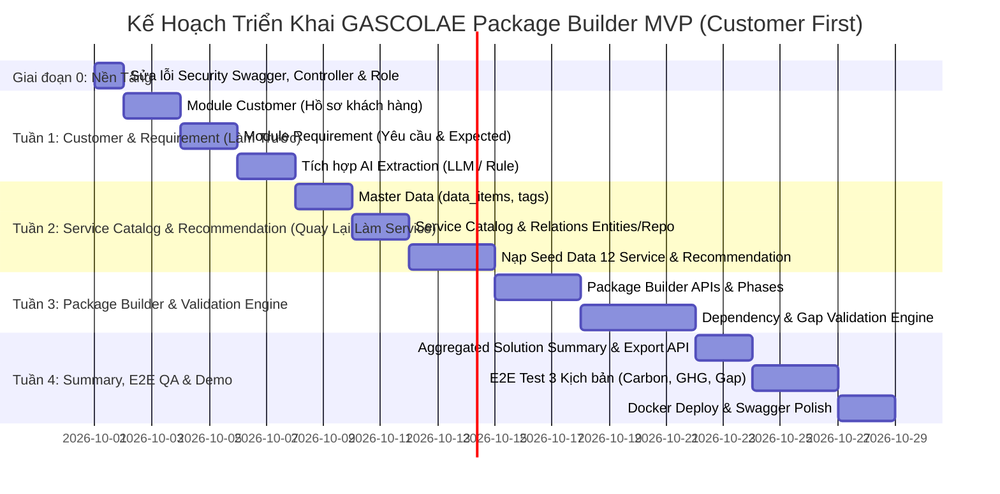

# GASCOLAE Intelligent Service Package Builder
## Kế Hoạch Triển Khai Backend & Kiến Trúc Hệ Thống (MVP 4 Tuần)

- **Dự án**: GASCOLAE Service Package Builder (Extra Innovation / Enterprise MVP)
- **Tài liệu căn cứ**:
  - Đặc tả nghiệp vụ: [GASCOLAE_Service_Package_Builder_MVP.md](./GASCOLAE_Service_Package_Builder_MVP.md)
  - Thiết kế cơ sở dữ liệu: [GASCOLAE_Database_Design_V2_UUID_All_Tables.md](./GASCOLAE_Database_Design_V2_UUID_All_Tables.md)
  - Quy chuẩn lập trình: [.agents/skills/package-builder-conventions/SKILL.md](../.agents/skills/package-builder-conventions/SKILL.md)
- **Đối tượng phụ trách**: Sinh viên 1 (Backend Lead / System Architect)
- **Chiến lược triển khai**: **Làm phần Customer & Requirement trước $\rightarrow$ Quay lại làm Service Catalog & Taxonomy $\rightarrow$ Recommendation $\rightarrow$ Package Builder & Validation $\rightarrow$ Summary & Demo**.
- **Thời gian thực hiện**: 04 tuần

---

## 1. Tổng Quan & Mục Tiêu Kỹ Thuật

Hệ thống **GASCOLAE Service Package Builder** là ứng dụng web cho phép đội ngũ Sales chuyển đổi nhu cầu của khách hàng (dạng form hoặc ngôn ngữ tự nhiên) thành một gói giải pháp gồm nhiều dịch vụ GASCOLAE có cấu trúc, kiểm tra tính tương thích/phụ thuộc đầu vào - đầu ra và bàn giao sang đội Operation.

### Nguyên tắc kỹ thuật bất biến
1. **Không xử lý dữ liệu UAV thực tế**: Không bay drone, không xử lý ảnh RAW/LiDAR hay telemetry; hệ thống chỉ vận hành trên tầng **Service Assets & Business Metadata** đã được xác minh.
2. **AI không phải Single Source of Truth**: LLM chỉ hỗ trợ trích xuất thông tin (Extraction) và tóm tắt; thuật toán gợi ý (Recommendation) và kiểm tra tính toàn vẹn (Validation) hoàn toàn vận hành dựa trên **Rule Engine & Database**.
3. **Mọi kết quả đều phải giải thích được**: Mỗi gợi ý dịch vụ phải trả về `recommendation_reason`, mỗi cảnh báo lỗi phải chỉ rõ mã dịch vụ và dữ liệu bị thiếu.

---

## 2. Kiến Trúc Kỹ Thuật & Quy Chuẩn Lập Trình

### 2.1 Công nghệ nền tảng
* **Ngôn ngữ & Runtime**: Java 21 LTS
* **Framework**: Spring Boot 4.x / 3.x
* **Bảo mật**: Spring Security, OAuth2 Resource Server, Nimbus JOSE JWT (Thuật toán HMAC-SHA512)
* **Cơ sở dữ liệu**: PostgreSQL (Schema: `package_builder`, UUID `gen_random_uuid()` làm khóa chính)
* **Object Mapping**: MapStruct 1.6.3 (`componentModel = "spring"`)
* **Tiện ích mã nguồn**: Lombok
* **Tài liệu API**: SpringDoc OpenAPI 3.x (Swagger UI)

### 2.2 Quy chuẩn kiến trúc (Package-by-Feature)
Hệ thống tổ chức theo mô hình module nghiệp vụ khép kín, phân tách rõ module **Customer** và **Requirement** được xây dựng trước:

```text
gascolae.group9.package_builder
├── config/                      # SecurityConfig, CustomJwtDecoder, PasswordEncoder, ApplicationInitConfig
├── dto/
│   └── response/                # APIResponse<T> chuẩn hóa toàn bộ JSON trả về
├── exception/                   # AppException, ErrorCode, GlobalExceptionHandler
├── user/                        # [ĐÃ XONG] Quản lý User, Role, Auth, Invalidation Token
├── customer/                    # [TUẦN 1 - LÀM TRƯỚC] Quản lý hồ sơ Khách hàng
├── requirement/                 # [TUẦN 1 - LÀM TRƯỚC] Yêu cầu dự án, Expected Outputs, Tags, AI Extraction
├── catalog/                     # [TUẦN 2] Service Catalog, Data Items, Tags, Service Relations
├── recommendation/              # [TUẦN 2] Thuật toán tính điểm & sinh lý do gợi ý dịch vụ
├── solution_package/            # [TUẦN 3] Quản lý gói giải pháp, gán vai trò dịch vụ, chia phase, câu hỏi mở
└── validation/                  # [TUẦN 3 & 4] Validation Run & Rule Engine phát hiện Gap/Dependency
```

### 2.3 Quy ước Code (Code Conventions)
1. **Lombok & Dependency Injection**:
   * Sử dụng `@RequiredArgsConstructor` kết hợp `@FieldDefaults(level = AccessLevel.PRIVATE, makeFinal = true)`.
   * Tuyệt đối không dùng `@Autowired` trực tiếp trên trường dữ liệu.
2. **Chuẩn hóa API Response**:
   * Mọi endpoint đều trả về `APIResponse<T>`.
   * Mã thành công mặc định là `1000`. Dữ liệu nằm trong trường `result`.
3. **Validation & Exception Handling**:
   * Annotation `@NotBlank(message = "...")` trên Request DTO phải map 1-1 với tên enum trong [ErrorCode.java](../package-builder/src/main/java/gascolae/group9/package_builder/exception/ErrorCode.java).
   * Lỗi nghiệp vụ ném ra `throw new AppException(ErrorCode.XYZ);` và được xử lý tự động qua `GlobalExceptionHandler`.
4. **JPA Entity & Auditing**:
   * Tên bảng số nhiều (ví dụ: `customers`, `services`).
   * Khóa chính UUID chuỗi: `@Id @GeneratedValue(strategy = GenerationType.UUID) String id;`.
   * Sử dụng `@EntityListeners(AuditingEntityListener.class)` với `@CreatedDate`, `@LastModifiedDate` (`createdAt`, `updatedAt`).

---

## 3. Phạm Vi Bảng Dữ Liệu (Scope & Schema Alignment)

Dựa trên [GASCOLAE_Database_Design_V2_UUID_All_Tables.md](./GASCOLAE_Database_Design_V2_UUID_All_Tables.md), MVP triển khai **20 bảng** (loại trừ `service_levels`):

| Nhóm chức năng | Tên bảng | Trình tự triển khai |
| :--- | :--- | :--- |
| **User & Auth** | `users`, `roles`, `user_roles`, `invalidated_tokens` | **Đã có sẵn** trong codebase, chỉ cần tinh chỉnh nhẹ. |
| **Customer & Requirement** | `customers`, `customer_requirements`, `requirement_expected_outputs`, `requirement_tags` | **Triển khai ở Tuần 1**: Tiếp nhận hồ sơ khách hàng và bóc tách nhu cầu. |
| **Catalog & Taxonomy** | `services`, `data_items`, `service_inputs`, `service_outputs`, `service_deliverables`, `service_deliverable_items`, `tags`, `service_tags`, `service_relations` | **Triển khai ở Tuần 2**: Danh mục dịch vụ, taxonomy inputs/outputs và quan hệ phụ thuộc. |
| **Recommendation** | `service_recommendations` | **Triển khai ở Tuần 2**: Kết nối Requirement (Tuần 1) với Catalog (Tuần 2). |
| **Package Builder** | `solution_packages`, `package_services`, `package_open_questions` | **Triển khai ở Tuần 3**: Xây dựng gói giải pháp, phân phase, câu hỏi mở. |
| **Validation Engine** | `validation_runs`, `validation_results` | **Triển khai ở Tuần 3**: Rule Engine kiểm tra thiếu input, thiếu dependency. |

---

## 4. Kế Hoạch Triển Khai 4 Tuần (Customer First)



---

### GIAI ĐOẠN 0: Dọn Dẹp Nền Tảng (Ngày 1)

* [ ] **Cấu hình Security**:
  * Chỉnh sửa [SecurityConfig.java](../package-builder/src/main/java/gascolae/group9/package_builder/config/SecurityConfig.java): Thêm quyền `HttpMethod.GET` cho `/swagger-ui/**`, `/v3/api-docs/**` để mở tài liệu API.
* [ ] **Loại bỏ Annotation thừa trên Controller**:
  * Xóa `@EntityListeners(AuditingEntityListener.class)` trên [UserController.java](../package-builder/src/main/java/gascolae/group9/package_builder/user/controller/UserController.java), [AuthenticateController.java](../package-builder/src/main/java/gascolae/group9/package_builder/user/controller/AuthenticateController.java), [RoleController.java](../package-builder/src/main/java/gascolae/group9/package_builder/user/controller/RoleController.java).
* [ ] **Đồng bộ Role Enum**:
  * Cập nhật [RoleName.java](../package-builder/src/main/java/gascolae/group9/package_builder/user/enums/RoleName.java) hỗ trợ: `ADMIN`, `SALES_PRE_SALES`, `OPERATION`, `CUSTOMER`.
* [ ] **Dọn dẹp code nháp**:
  * Xóa file nháp [ServicePackage.java](../package-builder/src/main/java/gascolae/group9/package_builder/service_package/entity/ServicePackage.java).

---

### TUẦN 1: Customer & Customer Requirement (Làm Khách Hàng Trước) (Ngày 2 - Ngày 7)

> [!TIP]
> **Ưu điểm của hướng tiếp cận này**: Sales bắt đầu công việc từ khách hàng và bài toán thực tế. Hoàn thiện luồng Customer & Requirement giúp đội ngũ có ngay giao diện tiếp nhận bài toán và kiểm thử AI Extraction trước khi đi sâu vào danh mục dịch vụ.

#### 1. Module Customer (`customer/`):
* [ ] **Entity & Enum**:
  * Enum `CustomerStatus`: `ACTIVE`, `INACTIVE`.
  * Entity `Customer`: `customerId` (UUID PK), `customerCode` (Unique), `customerName`, `companyName`, `industry`, `contactEmail`, `contactPhone`, `status`, `createdAt`, `updatedAt`.
* [ ] **Repository**:
  * `CustomerRepository`: CRUD và tìm kiếm theo mã, email, tên công ty, ngành nghề.
* [ ] **DTOs & Mapper**:
  * Request: `CustomerCreateRequest`, `CustomerUpdateRequest`.
  * Response: `CustomerResponse`.
  * Mapper: `CustomerMapper` (MapStruct).
* [ ] **Service & Controller**:
  * `CustomerService` & `CustomerServiceImpl`.
  * `CustomerController`:
    * `POST /api/customers`: Tạo hồ sơ khách hàng mới.
    * `GET /api/customers`: Danh sách khách hàng (tìm kiếm & phân trang).
    * `GET /api/customers/{id}`: Chi tiết khách hàng.
    * `PUT /api/customers/{id}`: Sửa thông tin khách hàng.
    * `PUT /api/customers/{id}/status`: Kích hoạt / Tạm dừng.

#### 2. Module Requirement & Extraction (`requirement/`):
* [ ] **Entity & Enum**:
  * Enum `RequirementStatus`: `DRAFT`, `CONFIRMED`, `ARCHIVED`.
  * Enum `ExtractionMethod`: `MANUAL`, `AI`.
  * Entity `CustomerRequirement`: `requirementId`, `requirementCode` (Unique), `customerId` (FK), `projectName`, `rawRequirementText`, `industryRaw`, `environmentRaw`, `areaValue`, `areaUnit`, `objectiveRaw`, `extractionMethod`, `extractionConfidence`, `status`, `createdBy`, `confirmedBy`, `confirmedAt`, `createdAt`, `updatedAt`.
  * Entity `RequirementExpectedOutput`: lưu đầu ra kỳ vọng (dạng text thô `rawExpectedOutput` hoặc `dataItemId` sau khi có taxonomy).
* [ ] **Repository**:
  * `CustomerRequirementRepository`, `RequirementExpectedOutputRepository`.
* [ ] **DTOs & Mapper**:
  * Request: `RequirementCreateRequest`, `RequirementExtractRequest`.
  * Response: `RequirementResponse`, `RequirementExtractionResponse`.
  * Mapper: `RequirementMapper`.
* [ ] **AI Extraction Service**:
  * `RequirementExtractionService`: Tích hợp Gemini LLM API (hoặc Regex fallback) để bóc tách bài toán tự nhiên thành JSON:
    ```json
    {
      "industry": "Forestry",
      "environment": "Forest",
      "area_value": 2000,
      "area_unit": "ha",
      "objective": "Carbon Project",
      "expected_outputs": ["MRV", "Biomass Map"]
    }
    ```
* [ ] **Controller**:
  * `POST /api/requirements/extract`: Nhận prompt văn bản $\rightarrow$ trả kết quả trích xuất để Sales kiểm tra, chỉnh sửa.
  * `POST /api/requirements`: Lưu yêu cầu dự án chính thức.
  * `GET /api/requirements/{id}`: Chi tiết yêu cầu.
  * `GET /api/customers/{customerId}/requirements`: Lịch sử các yêu cầu của một khách hàng.

---

### TUẦN 2: Service Catalog, Taxonomy & Recommendation Engine (Quay Lại Làm Dịch Vụ) (Ngày 8 - Ngày 14)

**Mục tiêu**: Sau khi đã có dữ liệu Customer & Requirement, xây dựng toàn bộ danh mục dịch vụ GASCOLAE, chuẩn hóa taxonomy đầu vào/đầu ra và hoàn thiện thuật toán gợi ý dịch vụ có giải thích.

#### Công việc chi tiết:
1. **Catalog & Taxonomy Layer (`catalog/`)**:
   * Tạo Entity & Repository:
     * `Tag`, `ServiceTag`: phân loại (`OBJECTIVE`, `INDUSTRY`, `ENVIRONMENT`, `TOPIC`).
     * `DataItem`: taxonomy trung tâm cho inputs, outputs, deliverables.
     * `Service`: dịch vụ GASCOLAE, category, use cases, customer problems.
     * `ServiceInput`: đầu vào kèm cờ `required` và nguồn cung cấp `provided_by` (`CUSTOMER`, `GASCOLAE`, v.v.).
     * `ServiceOutput`: đầu ra sinh ra bởi dịch vụ.
     * `ServiceDeliverable`, `ServiceDeliverableItem`: sản phẩm bàn giao cam kết.
     * `ServiceRelation`: mô hình hóa quan hệ phụ thuộc (`PROVIDES_INPUT_FOR`, `RECOMMENDED_WITH`, `ALTERNATIVE_TO`, `OVERLAPS_WITH`) kèm `via_data_item_id`.
   * DTOs & Mapper: `ServiceMapper`, `DataItemMapper`, `TagMapper`.
   * APIs:
     * `GET /api/catalog/services`: Danh sách dịch vụ kèm bộ lọc category, tag, keyword.
     * `GET /api/catalog/services/{id}`: Chi tiết dịch vụ đầy đủ.
     * `GET /api/catalog/data-items`: Danh sách taxonomy inputs/outputs.
     * `GET /api/catalog/tags`: Danh mục tag phân loại.
2. **Nạp Seed Data 12 Dịch Vụ Mẫu**:
   * Viết `CatalogDataInitializer` nạp sẵn 12 dịch vụ đã xác minh kèm inputs, outputs và relations từ dataset của bạn SV3.
3. **Recommendation Engine (`recommendation/`)**:
   * Entity: `ServiceRecommendation` (lưu match score thành phần và `recommendation_reason`).
   * Xây dựng `RecommendationService` so khớp Requirement (từ Tuần 1) với Catalog (vừa tạo):
     $$\text{Total Score} = w_{\text{obj}} \cdot S_{\text{obj}} + w_{\text{usecase}} \cdot S_{\text{usecase}} + w_{\text{ind}} \cdot S_{\text{ind}} + w_{\text{output}} \cdot S_{\text{output}} + w_{\text{tag}} \cdot S_{\text{tag}}$$
   * Tự động sinh lý do:
     * *Ví dụ: "Khớp mục tiêu: Carbon Project (+30đ); Khớp đầu ra kỳ vọng: MRV (+25đ); Khớp môi trường: Forest (+20đ)"*
   * API: `GET /api/requirements/{id}/recommendations`: Trả danh sách dịch vụ gợi ý xếp theo điểm kèm lý do.

---

### TUẦN 3: Solution Package Builder & Validation Engine (Ngày 15 - Ngày 21)

**Mục tiêu**: Cho phép Sales tạo gói giải pháp (thêm/bớt/sắp xếp dịch vụ, chia phase) và xây dựng Rule Engine tự động quét lỗi phụ thuộc, thiếu dữ liệu đầu vào.

#### Công việc chi tiết:
1. **Package Builder Module (`solution_package/`)**:
   * Tạo Entity & Repository: `SolutionPackage`, `PackageService`, `PackageOpenQuestion`.
   * API Quản lý Package:
     * `POST /api/packages`: Tạo mới gói giải pháp từ một `requirement_id`.
     * `POST /api/packages/{id}/services`: Thêm dịch vụ vào gói (gán `service_role`: `CORE`, `SUPPORTING`, `OPTIONAL`, `phase_no`, `sort_order`).
     * `PUT /api/packages/{id}/services/{serviceId}`: Điều chỉnh vai trò hoặc thứ tự phase.
     * `DELETE /api/packages/{id}/services/{serviceId}`: Gỡ dịch vụ khỏi gói.
     * `POST /api/packages/{id}/questions`: Thêm câu hỏi mở cần làm rõ với Operation/Customer.
2. **Dependency & Gap Validation Engine (`validation/`)**:
   * Tạo Entity & Repository: `ValidationRun`, `ValidationResult`.
   * Triển khai `PackageValidationService` kiểm tra 4 quy tắc:
     1. **`MISSING_REQUIRED_INPUT`**: Quét các `service_inputs` bắt buộc. Nếu `provided_by == 'GASCOLAE'`, kiểm tra xem các dịch vụ trong gói có sinh ra `data_item_id` này ở `service_outputs` không. Nếu thiếu $\rightarrow$ Báo lỗi `ERROR` và gợi ý dịch vụ hỗ trợ.
     2. **`MISSING_DEPENDENCY`**: Quét quan hệ `PROVIDES_INPUT_FOR`. Nếu Service B có trong gói mà Service A chưa có $\rightarrow$ Báo lỗi `ERROR`.
     3. **`DUPLICATE_DELIVERABLE`**: Kiểm tra trùng lặp `data_item_id` trong deliverables $\rightarrow$ Cảnh báo `WARNING`.
     4. **`NEED_MANUAL_VERIFICATION`**: Dịch vụ chưa xác minh $\rightarrow$ Cảnh báo `WARNING`.
   * Cập nhật trạng thái gói: `READY` (0 lỗi), `CONDITIONALLY_READY` (có warning), `GAP` (có lỗi).
   * API: `POST /api/packages/{id}/validate`: Chạy kiểm tra và trả về báo cáo kết quả chi tiết.

---

### TUẦN 4: Solution Summary, E2E Integration & Demo Handover (Ngày 22 - Ngày 28)

**Mục tiêu**: Cung cấp báo cáo tổng hợp bàn giao Sales-to-Ops, kiểm thử toàn diện 3 kịch bản demo chính, đóng gói Docker và hoàn thiện tài liệu.

#### Công việc chi tiết:
1. **Solution Summary Aggregator API**:
   * API: `GET /api/packages/{id}/summary`:
     * Thông tin khách hàng & yêu cầu dự án.
     * Danh sách dịch vụ theo từng Phase kèm vai trò (Core/Supporting/Optional).
     * Bảng tổng hợp **Required Inputs** (dữ liệu khách hàng cần chuẩn bị).
     * Bảng tổng hợp **Deliverables** (sản phẩm cam kết bàn giao).
     * Bảng kết quả **Validation Status** (`READY`, `CONDITIONALLY_READY`, `GAP`) và các lưu ý kỹ thuật.
     * Danh sách **Open Questions** đang mở/đã giải quyết.
2. **Kiểm thử tích hợp (E2E Integration Testing)**:
   * Viết Test Suite tự động chạy 3 kịch bản demo:
     * **Kịch bản 1 (Forest Carbon Project)**: Yêu cầu rừng 2.000 ha $\rightarrow$ Gợi ý Carbon Assessment + Biomass Mapping $\rightarrow$ Tạo package đủ dịch vụ $\rightarrow$ Validation đạt `READY`.
     * **Kịch bản 2 (Missing Dependency Gap)**: Chọn Carbon Assessment nhưng cố ý bỏ Biomass Mapping $\rightarrow$ Validator bắt lỗi `MISSING_REQUIRED_INPUT` & `MISSING_DEPENDENCY` $\rightarrow$ Thêm lại dịch vụ $\rightarrow$ Validation chuyển sang `READY`.
     * **Kịch bản 3 (GHG Monitoring)**: Yêu cầu giám sát phát thải nhà kính.
3. **Đóng gói Docker & Bàn giao**:
   * Tinh chỉnh `docker-compose.yml` và `Dockerfile` để hệ thống khởi chạy ổn định với 1 câu lệnh `docker compose up -d`.
   * Hoàn thiện tài liệu Swagger UI (`/api/swagger-ui/index.html`) để bàn giao cho thành viên Frontend (SV2).

---

## 5. Danh Mục ErrorCode Bổ Sung

Bổ sung vào file [ErrorCode.java](../package-builder/src/main/java/gascolae/group9/package_builder/exception/ErrorCode.java):

```java
// 13xx - Customer & Catalog
CUSTOMER_NOT_FOUND(1301, "Không tìm thấy thông tin khách hàng", HttpStatus.NOT_FOUND),
CUSTOMER_CODE_EXISTED(1302, "Mã khách hàng đã tồn tại", HttpStatus.BAD_REQUEST),
SERVICE_NOT_FOUND(1303, "Không tìm thấy dịch vụ", HttpStatus.NOT_FOUND),
SERVICE_CODE_EXISTED(1304, "Mã dịch vụ đã tồn tại trong hệ thống", HttpStatus.BAD_REQUEST),
DATA_ITEM_NOT_FOUND(1305, "Không tìm thấy hạng mục dữ liệu", HttpStatus.NOT_FOUND),
TAG_NOT_FOUND(1306, "Không tìm thấy tag phân loại", HttpStatus.NOT_FOUND),

// 14xx - Requirement & Extraction
REQUIREMENT_NOT_FOUND(1401, "Không tìm thấy yêu cầu của khách hàng", HttpStatus.NOT_FOUND),
EXTRACTION_FAILED(1402, "Trích xuất thông tin yêu cầu thất bại", HttpStatus.BAD_REQUEST),

// 15xx - Package & Validation
PACKAGE_NOT_FOUND(1501, "Không tìm thấy gói giải pháp", HttpStatus.NOT_FOUND),
SERVICE_ALREADY_IN_PACKAGE(1502, "Dịch vụ đã có trong gói giải pháp", HttpStatus.BAD_REQUEST),
SERVICE_NOT_IN_PACKAGE(1503, "Dịch vụ không tồn tại trong gói giải pháp", HttpStatus.NOT_FOUND),
PACKAGE_CANNOT_BE_MODIFIED(1504, "Gói giải pháp đã được xác nhận, không thể chỉnh sửa", HttpStatus.BAD_REQUEST),
QUESTION_NOT_FOUND(1505, "Không tìm thấy câu hỏi mở", HttpStatus.NOT_FOUND);
```

---

## 6. Phân Công & Ma Trận Phối Hợp (3 Thành Viên)

| Phân hệ / Tuần | SV1 (Backend Lead) | SV2 (Frontend / UX) | SV3 (Data / AI / QA) |
| :--- | :--- | :--- | :--- |
| **Giai đoạn 0** | Fix lỗi nền tảng, dọn dẹp controller & security | Chuẩn bị project frontend, setup routing | Rà soát taxonomy & dataset |
| **Tuần 1** | **Xây dựng API Customer CRUD, Requirement & AI Extraction** | **Thiết kế form tạo Khách hàng, giao diện nhập Requirement (Prompt text)** | Chuẩn hóa danh sách khách hàng mẫu, prompt test AI extraction |
| **Tuần 2** | **Xây dựng Schema Service Catalog, Taxonomy & Engine Recommendation** | **Thiết kế giao diện Service Catalog, trang chi tiết và UI hiển thị gợi ý** | Chuẩn hóa dataset 12 service, bộ relations và taxonomy tags |
| **Tuần 3** | Xây dựng API Package Builder, chia phase, viết Rule Engine phát hiện Gap/Dependency. | Giao diện Package Builder (thêm/bớt/kéo thả xếp phase), Panel cảnh báo lỗi Validation. | Xây dựng bộ ma trận `service_relations` chuẩn, kịch bản test Gap. |
| **Tuần 4** | Xây dựng API Solution Summary, xuất dữ liệu, Docker hóa và fix bug tích hợp. | Giao diện Solution Summary, tính năng in ấn / xuất PDF, tối ưu UI. | Chạy thử 3 Kịch bản Demo, viết User Guide, kiểm thử nghiệm thu cuối cùng. |
