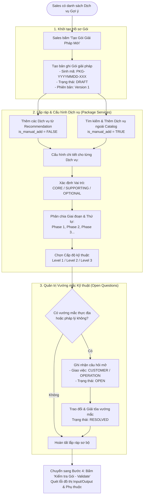

# ĐẶC TẢ NGHIỆP VỤ & ÁNH XẠ CƠ SỞ DỮ LIỆU
## CHỨC NĂNG: ĐÓNG GÓI GIẢI PHÁP (SOLUTION PACKAGE BUILDER)

---

## 1. TỔNG QUAN NGHIỆP VỤ

### 1.1 Mục tiêu chức năng
Cung cấp không gian làm việc (Solution Workspace / Package Builder) cho nhân viên Sales/Pre-Sales để kết hợp các dịch vụ kỹ thuật số đơn lẻ thành một **Gói giải pháp tổng thể (Solution Package / Turnkey Solution)** hoàn chỉnh nhằm giải quyết trọn vẹn đề bài của khách hàng.

Thay vì bán từng chuyến bay drone hay từng thuật toán AI rời rạc, Package Builder cho phép Sales:
1. **Lắp ghép các dịch vụ:** Chọn từ danh sách đề xuất của [Recommendation Engine](./GASCOLAE_Spec_Service_Recommendation.md) hoặc tìm kiếm bổ sung từ Catalog.
2. **Phân định vai trò dịch vụ:** Xác định dịch vụ nào là xương sống cốt lõi (`CORE`), dịch vụ nào làm dữ liệu nền bổ trợ (`SUPPORTING`), dịch vụ nào là tùy chọn thêm (`OPTIONAL`).
3. **Lập lộ trình thi công theo Giai đoạn (Phasing):** Phân bổ dịch vụ vào Phase 1 (Thu thập thực địa), Phase 2 (Xử lý bản đồ), Phase 3 (Phân tích AI & Báo cáo).
4. **Chọn Cấp độ kỹ thuật (`service_levels`):** Chọn Level 1, 2 hay 3 cho từng dịch vụ để cân đối giữa độ chính xác và ngân sách.
5. **Ghi nhận các vướng mắc kỹ thuật (`package_open_questions`):** Lưu trữ các câu hỏi mở cần làm rõ với Khách hàng hoặc đội Vận hành (Operation) trước khi ký hợp đồng.

### 1.2 Vai trò và tác nhân (Actors)
* **Nhân viên Sales / Pre-Sales:** Người trực tiếp lắp ráp, cấu hình giai đoạn, chọn cấp độ và điều phối giải tỏa câu hỏi mở.
* **Kỹ sư Vận hành (Operation Engineer):** Tham gia rà soát tính khả thi kỹ thuật ngoài hiện trường và trả lời các câu hỏi mở chuyên môn.
* **Khách hàng (Client):** Cung cấp các thông tin bổ sung để giải tỏa các câu hỏi mở liên quan đến pháp lý, ranh giới, điều kiện mặt bằng.

---

## 2. QUY TRÌNH NGHIỆP VỤ (BUSINESS WORKFLOW)

### 2.1 Sơ đồ dòng nghiệp vụ



### 2.2 Các bước nghiệp vụ chi tiết

#### Bước 1: Khởi tạo Hồ sơ Gói giải pháp
* Từ màn hình kết quả gợi ý hoặc chi tiết yêu cầu dự án, Sales bấm nút **`[ + Tạo Gói Giải Pháp Mới ]`**.
* Hệ thống sinh mã định danh duy nhất cho gói: `package_code` (ví dụ: `PKG-20261005-001`).
* Gán trạng thái ban đầu là `DRAFT` và thiết lập phiên bản `current_version = 1`.

#### Bước 2: Đưa dịch vụ vào Gói (Thêm từ gợi ý hoặc thêm thủ công)
Sales có 2 nguồn để đưa dịch vụ vào gói:
1. **Dịch vụ được gợi ý (Recommended Services):** Các dịch vụ đạt điểm cao mà Sales đã bấm chọn (`accepted = TRUE`). Dịch vụ này được đánh dấu cờ `is_manual_add = FALSE`.
2. **Dịch vụ thêm thủ công (Manual Add):** Sales có thể mở kho Catalog để tìm kiếm và nhặt thêm bất kỳ dịch vụ nào theo kinh nghiệm cá nhân. Dịch vụ này được đánh dấu cờ `is_manual_add = TRUE`.

#### Bước 3: Cấu hình 3 thông số nghiệp vụ cho từng dịch vụ
Với mỗi dịch vụ nằm trong gói, Sales tiến hành cấu hình:
1. **Phân định vai trò (`service_role`):**
   * Bắt buộc gói phải có ít nhất một dịch vụ đóng vai trò **`CORE`** (xương sống đáp ứng mục tiêu của khách).
   * Các dịch vụ chuẩn bị dữ liệu đầu vào được gán là **`SUPPORTING`**.
   * Các dịch vụ tăng thêm tiện ích được gán là **`OPTIONAL`**.
2. **Phân chia giai đoạn & thứ tự (`phase_no`, `sort_order`):**
   * Xếp các dịch vụ vào các Phase tuần tự (Phase 1 $\rightarrow$ Phase 2 $\rightarrow$ Phase 3).
   * Sắp xếp thứ tự thi công bên trong cùng một phase (`sort_order = 1, 2, 3...`).
3. **Chọn Cấp độ dịch vụ (`selected_level_id`):**
   * Chọn cấp độ kỹ thuật phù hợp với yêu cầu độ chính xác và ngân sách của dự án (Level 1: Cơ bản, Level 2: Tiêu chuẩn, Level 3: AI nâng cao).

#### Bước 4: Ghi nhận & Điều phối Câu hỏi mở (`package_open_questions`)
Trong các dự án UAV thực tế, luôn có những rủi ro ngoài thực địa chưa thể chốt ngay (ví dụ: điều kiện thời tiết, vùng cấm bay quân sự, trạm phát sóng...).
* Sales tạo câu hỏi mở và phân quyền trả lời:
  * Giao cho **Khách hàng (`CUSTOMER`)**: Ví dụ *"Khu vực rừng có đường ô tô vào được để mang máy phát điện sạc drone không?"*.
  * Giao cho **Đội Vận hành (`OPERATION`)**: Ví dụ *"Drone mẫu M300 có chịu được gió cấp 5 tại khu vực đỉnh đồi không?"*.
* Vướng mắc sẽ được theo dõi qua 3 trạng thái: `OPEN` (Chưa trả lời) $\rightarrow$ `ANSWERED` (Đã có phương án) $\rightarrow$ `RESOLVED` (Đã thống nhất).

#### Bước 5: Sẵn sàng kiểm định
Sau khi hoàn tất việc xếp dịch vụ và phân chia Phase, gói giải pháp sẵn sàng để chuyển sang bước **[Kiểm Định Tính Toàn Vẹn Kỹ Thuật (Validation Engine)]** để quét lỗi đứt gãy dữ liệu trước khi xuất hợp đồng.

---

## 3. ÁNH XẠ CƠ SỞ DỮ LIỆU: 3 BẢNG PHÂN HỆ PACKAGE BUILDER

Phân hệ Đóng gói giải pháp được lưu trữ và quản lý qua **3 bảng cơ sở dữ liệu**:

```
[ customer_requirements ]
           │ (1-N)
           ▼
  [ solution_packages ] ────────(1-N)────────► [ package_open_questions ]
           │ (1-N)
           ▼
   [ package_services ] ────────(N-1)────────► [ services ] & [ service_levels ]
```

---

### 3.1 Bảng 1: `solution_packages` (Hồ sơ gói giải pháp)

Quản lý thông tin chung, phiên bản và trạng thái sẵn sàng kỹ thuật của toàn bộ phương án.

| Cột Database (`solution_packages`) | Kiểu dữ liệu | Ý nghĩa nghiệp vụ | Quy tắc & Nguồn gốc giá trị |
| :--- | :--- | :--- | :--- |
| `package_id` | UUID | Khóa chính tự sinh (UUID v4) | Định danh duy nhất gói giải pháp |
| `requirement_id` | UUID (FK) | Đề bài dự án cần giải quyết | Khóa ngoại liên kết bảng `customer_requirements` |
| `package_code` | VARCHAR(50) | Mã định danh gói duy nhất | Sinh tự động theo cú pháp: `PKG-YYYYMMDD-XXX` |
| `package_name` | VARCHAR(255) | Tên gói giải pháp đề xuất | Tự sinh hoặc do Sales đặt (VD: *"Gói Đo Carbon & Bản Đồ 3D Rừng Bình Phước"*) |
| `package_status` | VARCHAR(30) | Trạng thái sẵn sàng kỹ thuật | Bắt đầu là `DRAFT`; sau khi chạy Validator sẽ tự đổi thành `READY`, `CONDITIONALLY_READY`, hoặc `GAP` |
| `current_version` | INT | Số phiên bản của gói | Bắt đầu từ `1`, tăng lên khi Sales chỉnh sửa cấu trúc lớn sau khi đã duyệt |
| `created_by` | VARCHAR(255) | Username nhân viên Sales tạo gói | Lấy từ phiên đăng nhập của nhân viên Sales |
| `created_at`, `updated_at` | TIMESTAMP | Mốc thời gian tạo & cập nhật | Ghi nhận tự động theo thời gian thực |

---

### 3.2 Bảng 2: `package_services` (Dịch vụ cấu thành trong gói)

Quản lý chi tiết từng "miếng ghép Lego" kỹ thuật được đưa vào gói, vai trò, giai đoạn và cấp độ đã chọn.

| Cột Database (`package_services`) | Kiểu dữ liệu | Ý nghĩa nghiệp vụ | Quy tắc & Nguồn gốc giá trị |
| :--- | :--- | :--- | :--- |
| `package_service_id` | UUID | Khóa chính tự sinh (UUID v4) | Định danh dòng dịch vụ trong gói |
| `package_id` | UUID (FK) | Thuộc gói giải pháp nào | Khóa ngoại liên kết bảng `solution_packages` |
| `service_id` | UUID (FK) | Dịch vụ được chọn | Khóa ngoại liên kết bảng `services` (1 trong 12 dịch vụ) |
| `service_role` | VARCHAR(20) | Vai trò dịch vụ trong gói | `CORE` (Cốt lõi), `SUPPORTING` (Bổ trợ), `OPTIONAL` (Tùy chọn) |
| `phase_no` | INT | Thuộc Giai đoạn triển khai nào | Số nguyên dương: `1`, `2`, `3`... |
| `sort_order` | INT | Thứ tự triển khai trong Phase | Số nguyên dương: `1`, `2`, `3`... |
| `selected_level_id` | UUID (FK) | Cấp độ dịch vụ được chọn | Khóa ngoại liên kết bảng `service_levels` (Level 1, 2 hoặc 3) |
| `is_manual_add` | BOOLEAN | Dịch vụ thêm tay hay từ gợi ý? | `FALSE` nếu lấy từ Recommendation; `TRUE` nếu Sales tự nhặt từ Catalog |
| `created_at` | TIMESTAMP | Thời điểm đưa dịch vụ vào gói | Ghi nhận tự động |

---

### 3.3 Bảng 3: `package_open_questions` (Quản trị Vướng mắc Kỹ thuật)

Bảng tương tác chuyên môn, đảm bảo toàn bộ rủi ro thực địa được giải tỏa trước khi ký hợp đồng.

| Cột Database (`package_open_questions`) | Kiểu dữ liệu | Ý nghĩa nghiệp vụ | Quy tắc & Nguồn gốc giá trị |
| :--- | :--- | :--- | :--- |
| `question_id` | UUID | Khóa chính tự sinh (UUID v4) | Định danh duy nhất câu hỏi |
| `package_id` | UUID (FK) | Thuộc gói giải pháp nào | Khóa ngoại liên kết bảng `solution_packages` |
| `question_text` | TEXT | Nội dung vướng mắc cần làm rõ | Ví dụ: *"Ranh giới bay có chồng lấn hành lang an toàn lưới điện không?"* |
| `owner_role` | VARCHAR(30) | Trách nhiệm trả lời thuộc về ai? | `CUSTOMER` (Khách hàng), `OPERATION` (Đội vận hành), `SALES_PRE_SALES` |
| `status` | VARCHAR(20) | Tiến độ giải quyết câu hỏi | `OPEN` (Chưa giải quyết), `ANSWERED` (Đã trả lời), `RESOLVED` (Đã thống nhất phương án) |
| `resolution_note` | TEXT | Ghi chú phương án thống nhất | Ghi lại kết quả sau khi trao đổi để làm căn cứ phụ lục hợp đồng |
| `created_at`, `updated_at` | TIMESTAMP | Mốc thời gian tạo & giải quyết | Ghi nhận tự động |

---

## 4. MA TRẬN PHÂN LOẠI VAI TRÒ DỊCH VỤ & PHÂN CHIA GIAI ĐOẠN

### 4.1 Bảng so sánh 3 vai trò dịch vụ (`service_role`)

| Tiêu chí | `CORE` (Cốt lõi) | `SUPPORTING` (Bổ trợ) | `OPTIONAL` (Tùy chọn) |
| :--- | :--- | :--- | :--- |
| **Bản chất** | Dịch vụ giải quyết trực tiếp mục tiêu dự án của khách. | Dịch vụ tạo dữ liệu đầu vào làm "bàn đạp" cho dịch vụ khác chạy. | Dịch vụ gia tăng tiện ích, có thể bỏ bớt nếu khách thiếu ngân sách. |
| **Số lượng tối thiểu** | **Bắt buộc $\ge 1$ dịch vụ** trong mỗi gói. | Tùy thuộc vào đồ thị Input/Output của dịch vụ Core. | Có thể bằng 0. |
| **Ví dụ thực tế** | Dịch vụ AI tính toán sinh khối & tín chỉ carbon rừng. | Dịch vụ Bay drone chụp ảnh trực giao và dựng bản đồ 3D. | Dịch vụ Cung cấp WebGIS 3D tương tác xem trực tuyến. |
| **Khi bị gỡ bỏ** | Gói giải pháp mất hoàn toàn ý nghĩa kinh doanh. | Hệ thống báo lỗi đứt gãy Input (`MISSING_REQUIRED_INPUT`). | Gói vẫn hợp lệ và triển khai bình thường. |

### 4.2 Ý nghĩa nghiệp vụ của việc chia Giai đoạn (Phasing)

Việc chia Phase (Phase 1, 2, 3...) giải quyết **3 bài toán thực tế**:
1. **Dây chuyền kỹ thuật (Technical Pipeline):** Đảm bảo dịch vụ thu thập dữ liệu (Phase 1) hoàn thành trước thì dịch vụ dựng ảnh (Phase 2) và phân tích AI (Phase 3) mới có dữ liệu để thực thi.
2. **Tiến độ thanh toán hợp đồng (Billing Milestones):** Khách hàng doanh nghiệp thường thanh toán theo từng giai đoạn: 30% khi ký hợp đồng, 40% khi nghiệm thu dữ liệu thô (Phase 1), và 30% khi bàn giao báo cáo cuối cùng (Phase 3).
3. **Phân bổ nhân sự thực tế:** Đội phi công bay UAV ra hiện trường ở Phase 1; Đội kỹ sư GIS/AI làm việc nội nghiệp tại văn phòng ở Phase 2 và 3.

---

## 5. CÁC QUY TẮC NGHIỆP VỤ BỔ TRỢ (BUSINESS RULES)

1. **Quy tắc Tính Toàn vẹn Lõi (Core Integrity Rule):**  
   Một Gói giải pháp không thể tồn tại nếu không có ít nhất một dịch vụ giữ vai trò **`CORE`**. Nếu Sales xóa hết dịch vụ Core, gói không thể chuyển sang trạng thái kiểm định.
2. **Quy tắc Trình tự Thời gian (Phase Chronology Rule):**  
   Dữ liệu đầu ra của một dịch vụ ở Phase $N$ chỉ có thể được sử dụng làm đầu vào cho các dịch vụ ở Phase $\ge N$. Không cho phép dịch vụ ở Phase 1 phụ thuộc vào dữ liệu do dịch vụ ở Phase 2 tạo ra (nghịch lý thời gian).
3. **Quy tắc Giải tỏa Vướng mắc (Open Questions Resolution Rule):**  
   Gói giải pháp chỉ có thể đạt trạng thái **`READY`** hoàn hảo khi **tất cả** các câu hỏi mở trong bảng `package_open_questions` đã chuyển sang trạng thái `RESOLVED`. Nếu còn câu hỏi `OPEN`, gói chỉ có thể đạt tối đa mức `CONDITIONALLY_READY` (Sẵn sàng có điều kiện).
4. **Quy tắc Đóng băng Phiên bản (Version Immutability Rule):**  
   Khi một gói giải pháp đã được xuất Proposal hoặc bàn giao sang cho đội Vận hành, phiên bản hiện tại sẽ bị đóng băng (`ARCHIVED`). Mọi điều chỉnh sau đó của Sales phải được tạo thành một phiên bản mới (`current_version + 1`).

---

## 6. BƯỚC TIẾP THEO TRONG HỆ THỐNG
Sau khi Sales hoàn thành việc lắp ráp gói giải pháp, hệ thống sẽ chuyển sang bước:  
👉 **[Đặc Tả Động Cơ Kiểm Định Tính Toàn Vẹn Kỹ Thuật (Validation Engine)](./GASCOLAE_Spec_Validation_Engine.md)** để tự động quét toàn bộ đồ thị Input/Output, phát hiện lỗ hổng thiếu sót (GAP) và đảm bảo tính khả thi tuyệt đối của hợp đồng.

