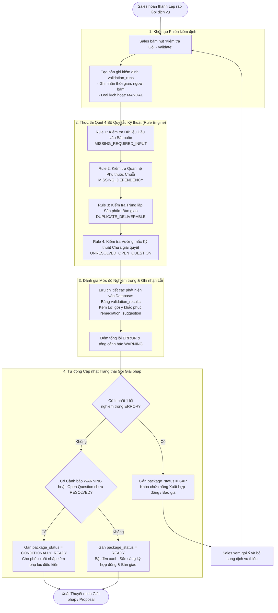

# ĐẶC TẢ NGHIỆP VỤ & ÁNH XẠ CƠ SỞ DỮ LIỆU
## CHỨC NĂNG: ĐỘNG CƠ KIỂM ĐỊNH TÍNH TOÀN VẸN KỸ THUẬT (VALIDATION ENGINE)

---

## 1. TỔNG QUAN NGHIỆP VỤ

### 1.1 Mục tiêu chức năng
Đóng vai trò là **"Trọng tài kỹ thuật tự động"**, Validation Engine quét toàn bộ cấu trúc của một Gói giải pháp ([solution_packages](./GASCOLAE_Spec_Solution_Package_Builder.md)) để phát hiện các lỗ hổng kỹ thuật, đứt gãy dòng chảy dữ liệu (Input/Output), thiếu sót phụ thuộc và sự lãng phí tài nguyên trước khi xuất hợp đồng báo giá cho khách hàng.

Validation Engine giải quyết triệt để 3 rủi ro kinh doanh lớn nhất:
1. **Bán gói giải pháp "trên trời" không thể thi công:** Ví dụ bán dịch vụ phân tích AI nhưng quên không bán dịch vụ bay drone thu thập dữ liệu thô.
2. **Trùng lặp sản phẩm gây lãng phí ngân sách:** Hai dịch vụ trong cùng một gói cùng tạo ra một bản đồ trùng lặp.
3. **Bỏ sót rủi ro thực địa:** Chưa giải tỏa các câu hỏi vướng mắc kỹ thuật (`open_questions`) với khách hàng nhưng đã vội vàng ký hợp đồng.

### 1.2 Vai trò và tác nhân (Actors)
* **Nhân viên Sales / Pre-Sales:** Người bấm nút kích hoạt kiểm định trên giao diện, xem danh sách cảnh báo và thực hiện các gợi ý khắc phục (bổ sung dịch vụ hoặc yêu cầu khách cấp dữ liệu).
* **Hệ thống Validation Engine (Backend Rule Engine):** Chạy các thuật toán quét đồ thị phụ thuộc (Graph / Dependency Check), đánh giá mức độ nghiêm trọng và tự động quyết định trạng thái sẵn sàng của gói.
* **Kỹ sư Vận hành (Operation Engineer):** Người nhận bàn giao gói giải pháp sau khi gói đã đạt chứng chỉ xanh hoàn hảo (`READY`).

---

## 2. QUY TRÌNH NGHIỆP VỤ (BUSINESS WORKFLOW)

### 2.1 Sơ đồ dòng nghiệp vụ



### 2.2 Các bước nghiệp vụ chi tiết

#### Bước 1: Kích hoạt phiên kiểm định
* Nhân viên Sales bấm nút **`[ Kiểm Tra Tính Toàn Vẹn - Validate ]`** trên màn hình Package Builder.
* Hệ thống khởi tạo một phiên quét mới trong bảng `validation_runs`, ghi nhận người kích hoạt và thời điểm bắt đầu.

#### Bước 2: Thực thi quét 4 quy tắc kỹ thuật trọng yếu
Hệ thống rà soát toàn bộ các dịch vụ có trong gói đối chiếu với từ điển `data_items` và các quan hệ `service_relations`:
1. **Kiểm tra nguồn cấp dữ liệu đầu vào (Input Origin Check):** Mọi dữ liệu có cờ `is_required = TRUE` của một dịch vụ phải có nguồn gốc: hoặc do Khách hàng cung cấp (`provided_by = CUSTOMER`), hoặc do một dịch vụ ở Phase trước tạo ra.
2. **Kiểm tra chuỗi phụ thuộc (Dependency Chain Check):** Nếu Dịch vụ B có quan hệ `PROVIDES_INPUT_FOR` với Dịch vụ A, Dịch vụ B bắt buộc phải nằm trong gói và phải được xếp ở Phase $\le$ Phase của Dịch vụ A.
3. **Kiểm tra trùng lặp sản phẩm (Deliverable Overlap Check):** Kiểm tra xem có 2 dịch vụ nào trong gói cùng bàn giao chung một loại file dữ liệu (`data_item`) gây thừa thãi hay không.
4. **Kiểm tra vướng mắc kỹ thuật (Open Questions Check):** Đếm số lượng câu hỏi mở trong bảng `package_open_questions` còn ở trạng thái `OPEN` hoặc `ANSWERED` (chưa chốt `RESOLVED`).

#### Bước 3: Ghi nhận phát hiện kèm Lời khuyên khắc phục (Actionable Remediation)
* Mọi sai lệch đều được lưu vào bảng `validation_results`.
* Đặc biệt, hệ thống **không chỉ báo lỗi mà đưa ra giải pháp cụ thể**:
  * *Báo lỗi:* "Dịch vụ AI ở Phase 3 thiếu dữ liệu Bản đồ trực giao Orthophoto!"
  * *Gợi ý:* "Hãy thêm Dịch vụ S0269 (Bay quét UAV) vào Phase 1, hoặc tick chọn 'Khách hàng tự cung cấp ảnh trực giao'."

#### Bước 4: Tự động quyết định Trạng thái Gói (`package_status`)
Hệ thống tính toán tổng lỗi và cập nhật trực tiếp vào hồ sơ gói ([solution_packages](./GASCOLAE_Spec_Solution_Package_Builder.md#31-b%E1%BA%A3ng-1-solution_packages-h%E1%BB%93-s%C6%A1-g%C3%B3i-gi%E1%BA%A3i-ph%C3%A1p)):
* 🔴 **`GAP` (Bị hổng kỹ thuật):** Có ít nhất 1 lỗi `ERROR`. Gói **bị khóa**, không cho phép xuất báo giá chính thức.
* 🟡 **`CONDITIONALLY_READY` (Sẵn sàng có điều kiện):** Không có lỗi nghiêm trọng, nhưng còn cảnh báo `WARNING` (ví dụ: trùng deliverable hoặc còn câu hỏi thực địa đang chờ khách trả lời).
* 🟢 **`READY` (Hoàn hảo tuyệt đối):** Không còn bất kỳ lỗi hay cảnh báo nào. Gói đủ điều kiện 100% để xuất hợp đồng và bàn giao sang đội bay.

---

## 3. CHI TIẾT 4 BỘ QUY TẮC KIỂM ĐỊNH (CORE VALIDATION RULES)

| Mã Quy tắc (`rule_code`) | Mức độ nghiêm trọng (`severity`) | Tình huống phát hiện lỗi | Thông điệp cảnh báo (`message`) | Gợi ý khắc phục (`remediation_suggestion`) |
| :--- | :---: | :--- | :--- | :--- |
| **`MISSING_REQUIRED_INPUT`** | 🔴 **ERROR** | Dịch vụ trong gói đòi hỏi một dữ liệu bắt buộc (`is_required = TRUE`), nhưng không được dịch vụ nào ở Phase trước tạo ra và khách hàng cũng không có sẵn. | *"Dịch vụ [{service_name}] ở Phase {X} yêu cầu dữ liệu [{data_item_name}] nhưng không có nguồn cung cấp."* | *"Thêm dịch vụ sản sinh ra dữ liệu này vào Phase trước, hoặc đánh dấu Khách hàng tự cung cấp."* |
| **`MISSING_DEPENDENCY`** | 🔴 **ERROR** | Dịch vụ A có quan hệ tiền đề bắt buộc với Dịch vụ B (`is_required = TRUE`), nhưng Dịch vụ B không có mặt trong gói. | *"Dịch vụ [{service_A}] bắt buộc phải đi kèm với Dịch vụ [{service_B}] để đảm bảo khả năng triển khai."* | *"Bấm nút Thêm Dịch vụ [{service_B}] vào gói giải pháp."* |
| **`DUPLICATE_DELIVERABLE`** | 🟡 **WARNING** | Hai dịch vụ khác nhau trong gói cùng tạo ra chung một sản phẩm bàn giao kỹ thuật số (`data_item`). | *"Phát hiện trùng lặp sản phẩm: [{data_item_name}] đang được tạo ra bởi cả [{service_A}] và [{service_B}]."* | *"Cân nhắc hạ cấp độ (Level) của một trong hai dịch vụ hoặc gỡ bỏ dịch vụ không cần thiết để tối ưu chi phí."* |
| **`UNRESOLVED_OPEN_QUESTION`** | 🟡 **WARNING** | Gói dịch vụ vẫn còn câu hỏi kỹ thuật / pháp lý chưa được xác nhận hoàn tất (`status != RESOLVED`). | *"Vẫn còn {count} câu hỏi mở về điều kiện thực địa chưa được làm rõ với Khách hàng/Vận hành."* | *"Liên hệ với các bên liên quan để thống nhất phương án và chuyển trạng thái sang RESOLVED."* |

---

## 4. ÁNH XẠ CƠ SỞ DỮ LIỆU: 2 BẢNG PHÂN HỆ VALIDATION

Toàn bộ quá trình kiểm định và lịch sử bắt lỗi được lưu trữ tại **2 bảng cơ sở dữ liệu**:

```
[ solution_packages ]
         │ (1-N)
         ▼
 [ validation_runs ] ────────(1-N)────────► [ validation_results ]
   • total_errors                             • rule_code & severity
   • total_warnings                           • message
   • calculated_package_status                • remediation_suggestion
                                              • data_item_id & service_id
```

---

### 4.1 Bảng 1: `validation_runs` (Lịch sử các phiên kiểm định gói)

Ghi nhận tổng quan kết quả của mỗi lần chạy quét của Rule Engine trên một gói giải pháp.

| Cột Database (`validation_runs`) | Kiểu dữ liệu | Ý nghĩa nghiệp vụ | Quy tắc & Nguồn gốc giá trị |
| :--- | :--- | :--- | :--- |
| `validation_run_id` | UUID | Khóa chính tự sinh (UUID v4) | Định danh duy nhất phiên chạy kiểm định |
| `package_id` | UUID (FK) | Gói giải pháp được kiểm tra | Khóa ngoại liên kết bảng `solution_packages` |
| `trigger_type` | VARCHAR(30) | Cơ chế kích hoạt kiểm định | `MANUAL` (Sales bấm tay), `AUTO_ON_CHANGE` (Tự chạy khi sửa gói), `PRE_EXPORT` (Chạy trước khi in Proposal) |
| `calculated_package_status` | VARCHAR(30) | Trạng thái kỹ thuật tính toán được | `READY` (0 lỗi, 0 cảnh báo), `CONDITIONALLY_READY` (0 lỗi, >0 cảnh báo), `GAP` (>0 lỗi) |
| `total_errors` | INT | Tổng số lỗi nghiêm trọng (ERROR) | Số lượng lỗi chặn không cho xuất hợp đồng |
| `total_warnings` | INT | Tổng số cảnh báo cần lưu ý (WARNING) | Số lượng lưu ý về trùng lặp hoặc câu hỏi mở |
| `started_at`, `completed_at` | TIMESTAMP | Mốc thời gian bắt đầu và kết thúc | Ghi nhận thời gian thực thi (thường < 50ms) |
| `triggered_by` | VARCHAR(255) | Username nhân viên kích hoạt | Lấy từ phiên làm việc của Sales |

---

### 4.2 Bảng 2: `validation_results` (Chi tiết các phát hiện lỗi và cảnh báo)

Danh sách từng lỗi cụ thể được mổ xẻ chi tiết, gắn liền với dịch vụ và loại dữ liệu liên quan.

| Cột Database (`validation_results`) | Kiểu dữ liệu | Ý nghĩa nghiệp vụ | Quy tắc & Nguồn gốc giá trị |
| :--- | :--- | :--- | :--- |
| `validation_result_id` | UUID | Khóa chính tự sinh (UUID v4) | Định danh duy nhất dòng phát hiện lỗi |
| `validation_run_id` | UUID (FK) | Thuộc phiên kiểm tra nào | Khóa ngoại liên kết bảng `validation_runs` |
| `rule_code` | VARCHAR(50) | Mã định danh quy tắc bị vi phạm | `MISSING_REQUIRED_INPUT`, `MISSING_DEPENDENCY`, `DUPLICATE_DELIVERABLE`... |
| `severity` | VARCHAR(20) | Mức độ nghiêm trọng của lỗi | `ERROR` (Chặn xuất hợp đồng), `WARNING` (Cảnh báo lưu ý), `INFO` (Thông tin) |
| `service_id` | UUID (FK, Nullable) | Dịch vụ trực tiếp gây ra lỗi | Khóa ngoại trỏ đến bảng `services` (để bôi đỏ dịch vụ trên UI) |
| `data_item_id` | UUID (FK, Nullable) | Loại dữ liệu bị thiếu hoặc trùng | Khóa ngoại trỏ đến bảng `data_items` |
| `message` | TEXT | Nội dung thông báo lỗi chi tiết | Câu mô tả sự cố kỹ thuật bằng tiếng Việt dễ hiểu |
| `remediation_suggestion` | TEXT | Hướng dẫn hành động để sửa lỗi | **Lời khuyên thực tế giúp Sales giải quyết lỗi ngay tức thì** |
| `created_at` | TIMESTAMP | Mốc thời gian phát hiện lỗi | Ghi nhận tự động |

---

## 5. MA TRẬN LIÊN KẾT ĐỒ THỊ DỮ LIỆU ĐỂ BẮT LỖI

Để phát hiện lỗi `MISSING_REQUIRED_INPUT`, hệ thống đối chiếu dòng chảy dữ liệu qua **4 bảng trung gian**:

```
[ Dịch vụ B ở Phase 2 ] ──cần──► [ service_inputs ] ──yêu cầu──► [ data_items: DI_0012 ]
                                                                        │
                                   Hệ thống truy vết tìm nguồn cấp:     │
                                   1. Khách hàng có tick tự cấp không?  │
                                   2. Phase 1 có dịch vụ nào tạo ra     │
                                      DI_0012 này hay không?            │
                                                                        ▼
                                                   Tìm thấy tại: [ service_outputs ]
                                                   của [ Dịch vụ A ở Phase 1 ]
                                                   ──► HỢP LỆ (Không có lỗi)
```

Nếu tìm khắp cả khai báo của khách hàng và danh sách `service_outputs` của các Phase trước mà **không thấy ai sản sinh ra `DI_0012`** $\rightarrow$ Hệ thống lập tức bắn lỗi **`MISSING_REQUIRED_INPUT`**!

---

## 6. CÁC QUY TẮC NGHIỆP VỤ BỔ TRỢ (BUSINESS RULES)

1. **Quy tắc Chặn Xuất Hợp đồng (Zero-GAP Proposal Rule):**  
   Hệ thống nghiêm cấm xuất Báo giá chính thức hoặc Hợp đồng nếu gói giải pháp đang ở trạng thái `GAP`. Mọi lỗi `ERROR` bắt buộc phải được giải quyết triệt để.
2. **Quy tắc Đề xuất Khắc phục Khả thi (Actionable Remediation Rule):**  
   Bất kỳ dòng kết quả lỗi nào trong bảng `validation_results` bắt buộc phải đi kèm câu hướng dẫn `remediation_suggestion`. Không chấp nhận chỉ báo lỗi cụt lủn mà không chỉ ra cách giải quyết cho Sales.
3. **Quy tắc Kiểm tra Tự động Trước khi Bàn giao (Pre-Handover Verification):**  
   Ngay trước khi Sales bấm nút "Bàn giao cho Operation", hệ thống sẽ tự động kích hoạt một phiên kiểm định ngầm (`trigger_type = PRE_EXPORT`). Nếu phát hiện có thay đổi làm gói rơi vào trạng thái `GAP`, lệnh bàn giao sẽ bị hủy bỏ ngay lập tức.

---

## 7. BƯỚC TIẾP THEO TRONG HỆ THỐNG
Sau khi gói giải pháp vượt qua kiểm định và đạt trạng thái `READY` hoặc `CONDITIONALLY_READY`, hệ thống sẽ kích hoạt bước cuối cùng:  
👉 **[Đặc Tả Xuất Báo Cáo Giải Pháp & Bàn Giao Vận Hành (Solution Summary & Handover)](./GASCOLAE_Spec_Solution_Summary_Handover.md)** để tạo bản chào thầu (Proposal Draft) gửi khách hàng ký duyệt và chuyển toàn bộ thông số kỹ thuật cho đội bay triển khai thực địa.

